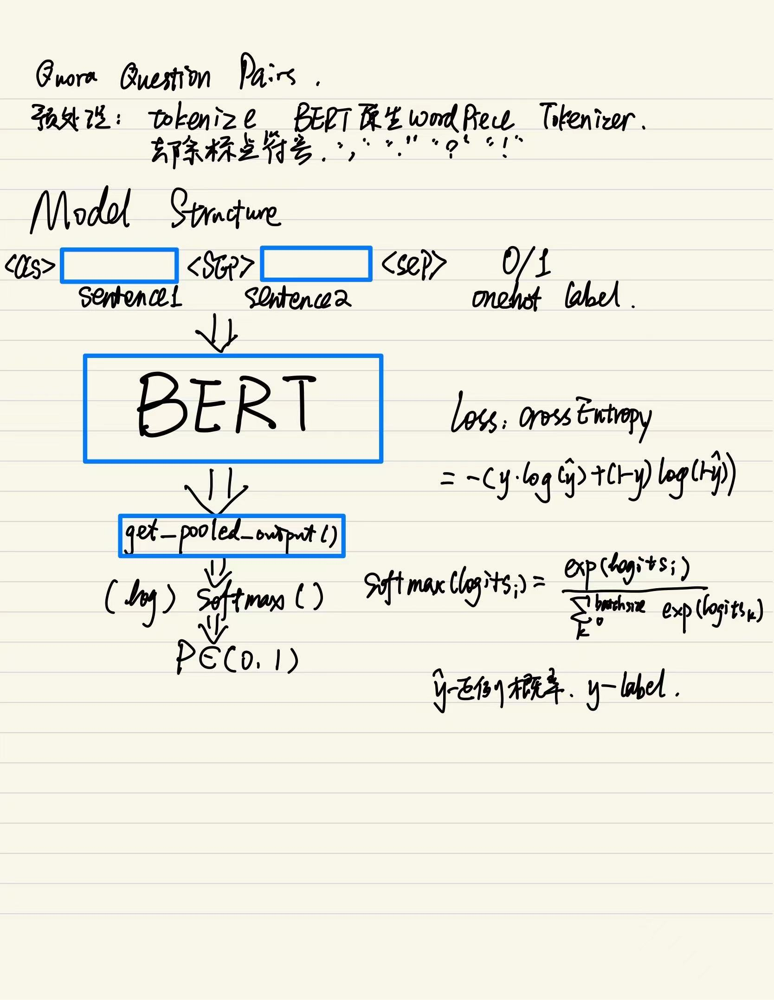

# QuoraQuestionPairs-Bert
This is an experiment of fine-tuning BERT on Quora Question Pairs, a famous project on Kaggle.\
[BERT Research Paper](https://arxiv.org/abs/1810.04805)\
[BERT Github](https://github.com/google-research/bert.git)\
The training process takes up to **20 hours on GPU**, **1 hour on TPU**.

---
## Model Structure

---
## Evaluation results
Evaluation results are on BERT base uncased model. For reproducing similar results, train for 3 epochs.

|**Metrics** | **Train Set** | **Dev Set** |
|---|---|---|
|**Loss**|0.150|0.497|
|**Accuracy**|0.969|0.907|
|**F1**|0.959|0.875|
|**AUC**|0.969|0.902|
|**Precision**|0.949|0.864|
|**Recall**|0.969|0.886|